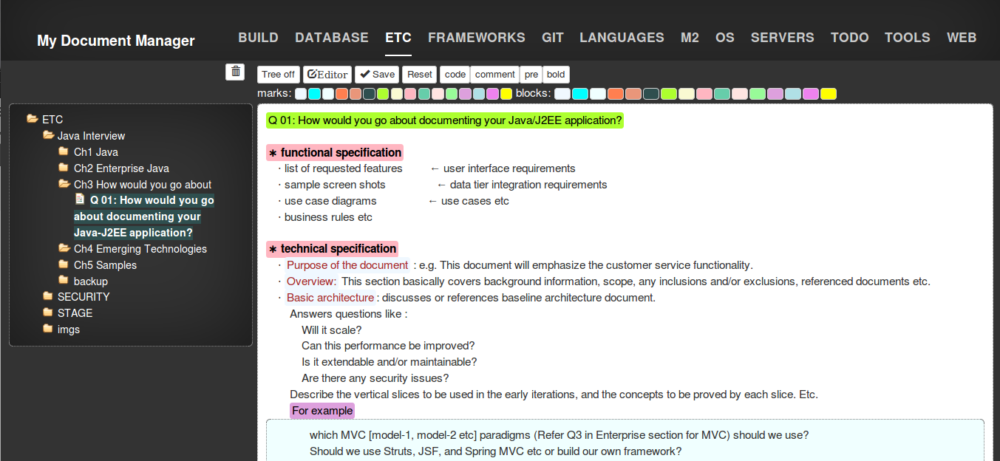

My Document Manager
===
My Document Manager is an app based on node.js and AngularJS. 

## Installation
```bash
$git clone https://github.com/jiyoungParkKim/myDocumentManager.git
$cd  myDocumentManager
$npm install
$bower install
$npm start
```
## Reference
 * angular-tree-control: https://github.com/wix/angular-tree-control
 * ace editor: https://github.com/ajaxorg/ace


## Heroku
[](https://heroku.com/deploy)


## Screen Shots





